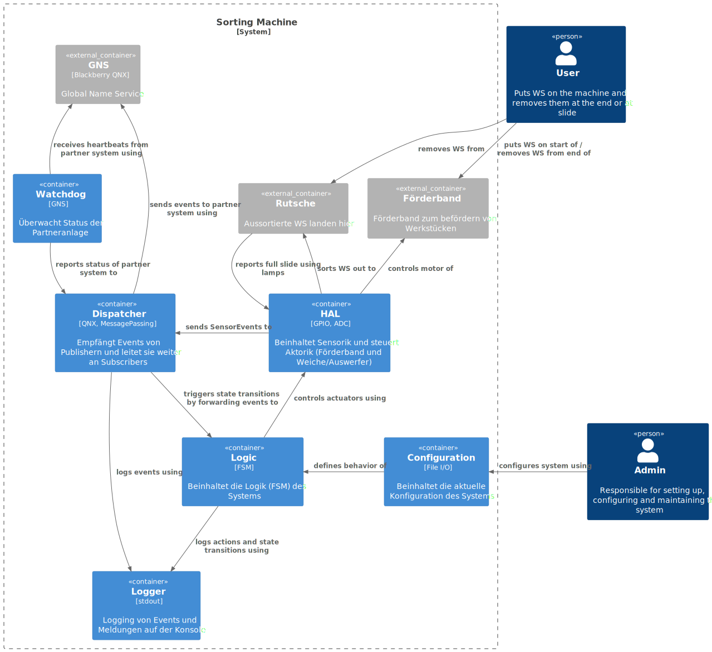

# Dokumentation

Dieses Verzeichnis enthält die Dokumentation des Projektes:

- [Code Dokumentation](code/html/index.html) (generiert mit Doxygen und der beiliegenden Konfigurationsdatei [Doxyfile](code/Doxyfile))
- [Diagramme](diagrams/)
- [Aufgabenstellung](esep_23SoSe-final.pdf)
- [RDT (Requirements Document Template)](RDT%20ESEP-2023SoSe-Team-2-1.pdf)

## Software Architektur

Das folgende Container-Diagramm stellt die einzelnen Komponenten und deren Abhängigkeiten dar.

### Configuration

Beinhaltet die aktuelle Konfiguration des Systems.

- Starten des Programms mit dem Flag "-s,--slave" -> Modus "Slave", ansonsten "Master"
- Starten des Programms mit dem Flag "-d,--debug" -> Debug-Modus (loggt Debug-Meldungen auf der Konsole)
- WS-Sortierreihenfolge: definiert durch die Konfigurationsdatei auf dem Master
- Auswerfer-Typ:
  - Starten des Programms mit dem Flag "-p,--pusher" -> Typ "Auswerfer" (aktiv = WS aussortieren)
  - Wenn Flag nicht gesetzt -> Weiche (aktiv = WS durchlassen)

### Logger

Zuständig für das Loggen von relevanten Meldungen auf der Konsole des jeweiligen Systems.
Jede Logging-Message beinhaltet:

- Zeitstempel (YYYY-MM-DD HH:MM:SS.mmm)
- Typ der Meldung: Fehler, Warnung, Info, Debug

### EventManager (Dispatcher)

Komponenten schicken Events (PulseMessages) an den Dispatcher.\
Bietet einen Kanal an, an den sich andere Komponenten "anschließen" können, um Events zu empfangen.\
Schickt Events an die Partneranlage über GNS (Global Name Service).

### Watchdog

Prüft zyklisch (z. B. alle 100ms), ob eine Verbindung zur Partneranlage besteht und meldet einen Verbindungsausfall per PulseMessage.
In folgenden Fällen wird auch eine PulseMessage gesendet, die das Funktionieren der Verbindung angibt:

- Start des Programms
- Wiederherstellen der Verbindung nach Ausfall

### HAL

HAL = "Hardware Abstraction Layer".

- Meldet das Auftreten von Sensor-Events per PulseMessage. In Sonderfällen werden eigene Aktoren auch sofort angesteuert nach einem Sensor-Event (z. B. E-Stopp gedrückt -> Abschalten des Motors)
- Bietet Methoden zur Ansteuerung der Aktoren an.

### Logic

Beinhaltet die Steuerungslogik (FSMs), z. B.:

- Aktueller Betriebsmodus: Ruhezustand, Betriebszustand, Fehler, E-Stopp
- Aktuell erwartetes Werkstück: **Typ A -> Typ B -> Typ C** und wieder von vorne. Wenn WS nicht der Reihung entspricht, wird eine Aussortierung getriggert
- Betriebsmodus Fehler: Verlassen durch Quittieren und wenn Fehler nicht mehr ansteht oder Fehler behebt sich selbst
